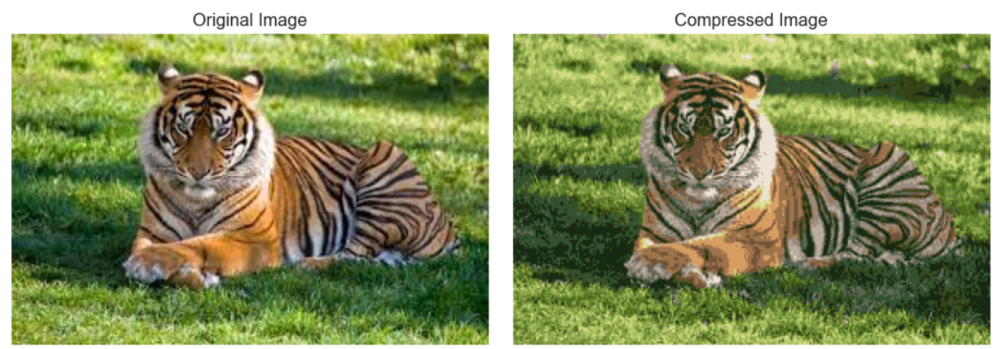

# Tiger_Image_Compression-KMeans

## Introduction
This project demonstrates how to use the K-Means clustering algorithm to compress an image by reducing the number of colors. A tiger image is used for this example.  

## About the Image
The image used in this project is a high-resolution picture of a tiger. By reducing the number of unique colors in the image, we can achieve compression while preserving the visual quality of the image.  

## Tools and Libraries
- **Python**  
- **NumPy**  
- **Scikit-learn**  
- **Matplotlib**  

## Image
  
